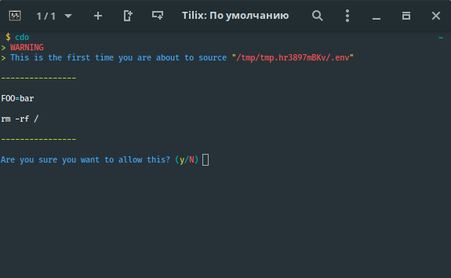

# Autoenv

#### Autoenv automatically sources (known/whitelisted) `.env` and `.out` files.

This plugin support for enter and leave events. By default `.env` is used for entering, and `.out` for leaving. And you can set variable `CLICOLOR=1` for enabling colored output.

The environment variables `$AUTOENV_IN_FILE` & `$AUTOENV_OUT_FILE` can be used
to override the default values for the names of `.env` & `.out` respectively.



## Example of use

- If you are in the directory `/home/user/dir1` and execute `cd /var/www/myproject` this plugin will source following files if they exist

```
/home/user/dir1/.out
/home/user/.out
/home/.out
/var/.env
/var/www/.env
/var/www/myproject/.env
```

- If you are in the directory `/` and execute `cd /home/user/dir1` this plugin will source following files if they exist

```
/home/.env
/home/user/.env
/home/user/dir1/.env
```

- If you are in the directory `/home/user/dir1` and execute `cd /` this plugin will source following files if they exist

```
/home/user/dir1/.out
/home/user/.out
/home/.out
```

## Example of `.env` and `.out` files useful for node.js developing

### .env

```sh
nvm use node
OLDPATH=$PATH
export PATH=`pwd`/node_modules/.bin:$PATH

```

### .out

```sh
nvm use system
export PATH=$OLDPATH

```

## Installation

### Using [zpm](https://github.com/zpm-zsh/zpm)

Add `zpm load zpm-zsh/autoenv` into `.zshrc`

### Using [oh-my-zsh](https://github.com/robbyrussell/oh-my-zsh)

Execute `git clone https://github.com/zpm-zsh/autoenv ~/.oh-my-zsh/custom/plugins/autoenv`. Add `autoenv` into plugins array in `.zshrc`

### Using [antigen](https://github.com/zsh-users/antigen)

Add `antigen bundle zpm-zsh/autoenv` into `.zshrc`

### Using [zgen](https://github.com/tarjoilija/zgen)

Add `zgen load zpm-zsh/autoenv` into `.zshrc`
